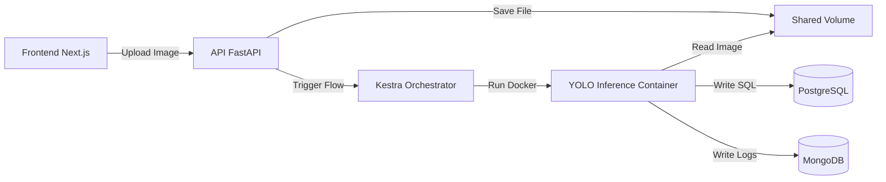

# Wildfire Detection System - Monorepo

Sistema de detecção de incêndios florestais usando Computer Vision (YOLOv8) com orquestração via Kestra e Frontend em Next.js.

## 📊 Status do Projeto

- ✅ **Backend:** API FastAPI Completa (Auth, Upload, Reports)
- ✅ **Pipeline:** Orquestração Kestra + ML Flow (YOLOv8)
- ✅ **Frontend:** Next.js Dashboard (Upload, Lista, Gráficos Chart.js, Bounding Boxes)
- ✅ **Infra:** Docker Compose (Postgres, Mongo, Kestra, API)
- ✅ **Setup Automatizado:** Script `setup.sh` para configuração completa
- ⏳ **Deploy:** Pendente

---

## 🚀 Guia de Instalação (AUTOMATIZADO)

### Método 1: Setup Automatizado (RECOMENDADO) ✨

Use o script `setup.sh` que configura **tudo automaticamente**:

```bash
cd back
./setup.sh
```

**O que o script faz:**
- ✅ Cria estrutura de diretórios
- ✅ Configura arquivo `.env` (se necessário)
- ✅ Sobe todos os containers Docker
- ✅ **Corrige permissões do volume compartilhado automaticamente**
- ✅ Gera o modelo de IA customizado (`custom_fire_model.pt`)
- ✅ Verifica status final

**Após o setup, você só precisa:**
1. Configurar o Kestra (veja seção abaixo)
2. Iniciar o Frontend

---

### Configuração do Kestra (Passo Manual Necessário) 🔐

Após rodar o `setup.sh`, acesse o Kestra:

1. **Acesse:** [http://localhost:8080](http://localhost:8080)

2. **Primeira vez?** O Kestra pedirá para criar o primeiro usuário:
   - Escolha qualquer email/senha (ex: `admin@kestra.io` / `kestra`)
   - **IMPORTANTE:** Anote as credenciais!

3. **Atualize o arquivo `.env`** com as credenciais que você criou:
   ```bash
   # Edite back/.env
   KESTRA_USER=admin@kestra.io
   KESTRA_PASSWORD=kestra
   ```

4. **Reinicie a API** para aplicar as credenciais:
   ```bash
   cd back
   docker-compose restart api
   ```

5. **Registre o Flow de Inferência:**
   - No Kestra UI, vá em **Flows** → **Create**
   - Copie o conteúdo de `back/kestra/flows/fire_inference.yaml`
   - Cole no editor e clique em **Save**

---

### Iniciar Frontend

```bash
cd front
npm install
npm run dev
```

Acesse: [http://localhost:3000](http://localhost:3000)

---

## 🔄 Reset Completo do Sistema

Para apagar tudo e reconfigurar do zero:

```bash
cd back
docker-compose down -v  # Remove containers e volumes
./setup.sh              # Reconfigura automaticamente
```

**Lembre-se:** Após o reset, você precisará:
1. Recriar o usuário no Kestra (http://localhost:8080)
2. Atualizar o `.env` com as novas credenciais
3. Registrar o flow novamente

---

## 🔗 Links de Acesso

| Serviço | URL | Credenciais |
| :--- | :--- | :--- |
| **Frontend** | [http://localhost:3000](http://localhost:3000) | Crie sua conta na tela de Signup |
| **API Docs** | [http://localhost:8000/docs](http://localhost:8000/docs) | - |
| **Kestra UI** | [http://localhost:8080](http://localhost:8080) | Definidas por você no primeiro acesso |

---

## 🏗️ Arquitetura



---

## 🛠️ Comandos Úteis

### Backend

```bash
cd back

# Ver status dos containers
docker-compose ps

# Ver logs
docker-compose logs -f api
docker-compose logs -f kestra

# Restart sem perder dados
docker-compose restart

# Parar tudo
docker-compose down
```

### Frontend

```bash
cd front

# Desenvolvimento
npm run dev

# Build de produção
npm run build

# Linter
npm run lint
```

---

## 📚 Documentação Técnica

- [Setup Script](./back/setup.sh) - Script de configuração automatizada
- [Permission Fix Guide](./back/PERMISSIONS_FIX.md) - Solução para problemas de permissão
- [Backend README](./back/README.md) - Documentação detalhada do backend
- [Commits Log](./back/commits.md) - Histórico de mudanças
- [Barriers & Trade-offs](./back/barriers.md) - Decisões arquiteturais

---

## 🐛 Troubleshooting

### Erro: "Permission denied" no Kestra

Execute o script de setup que corrige automaticamente:
```bash
cd back
./setup.sh
```

### Erro: "Port 8080 already in use"

```bash
# Verificar o que está usando a porta
sudo lsof -i :8080

# Matar processo
sudo kill -9 <PID>
```

### Erro: "401 Unauthorized" ao fazer upload

Verifique se:
1. Você criou o usuário no Kestra UI
2. Atualizou o `.env` com as credenciais corretas
3. Reiniciou a API: `docker-compose restart api`

---

## 🤝 Contribuindo

Este é um projeto de teste técnico. Para mais informações, consulte a documentação específica de cada módulo.

## 📝 Licença

Projeto educacional - Teste Técnico
