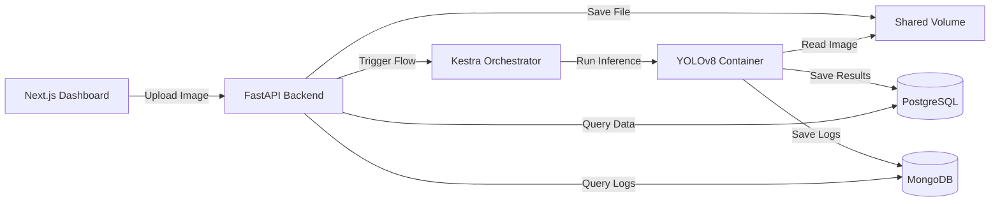

# 🔥 Fire Detection System

Sistema de detecção de incêndios usando Computer Vision (YOLOv8) com orquestração via Kestra e Dashboard em Next.js.

[](back/backend/tests/)
[](back/backend/tests/COVERAGE_REPORT.md)
[](back/docker-compose.yml)

---

## 🚀 Quick Start

### Pré-requisitos
- Docker & Docker Compose
- Node.js 18+
- Git

### Instalação Rápida (3 passos)

```bash
# 1. Clone o repositório
git clone https://github.com/p3dru/teste_tecnico_inforgeneses.git
cd teste_tecnico_inforgeneses

# 2. Configure e inicie o backend
cd back
cp .env.example .env
./setup.sh

# 3. Inicie o frontend
cd ../front
cp .env.local.example .env.local
npm install && npm run dev
```

**⚠️ Passo Manual Obrigatório:** Configure o Kestra em http://localhost:8080 (veja [Configuração do Kestra](#configuração-do-kestra))

### Acesso
- 🌐 **Frontend:** http://localhost:3000
- 📡 **API Docs:** http://localhost:8000/docs
- ⚙️ **Kestra UI:** http://localhost:8080

---

## 📖 Documentação Completa

**Precisa de ajuda?** Consulte nossos guias detalhados:

- 📦 **[INSTALLATION.md](INSTALLATION.md)** - Guia completo de instalação com troubleshooting
- 🧪 **[E2E Testing Guide](back/backend/tests/README.md)** - Como rodar os testes
- 🤖 **[TRAINING.md](back/TRAINING.md)** - Como treinar seu próprio modelo
- 🐛 **[Troubleshooting](INSTALLATION.md#-troubleshooting-completo)** - Soluções para problemas comuns

---

## 🏗️ Arquitetura



**Stack Tecnológica:**
- **Backend:** FastAPI, SQLAlchemy (Async), Beanie (MongoDB)
- **Frontend:** Next.js 14, React, Tailwind CSS, Chart.js
- **Orquestração:** Kestra (Docker Runner)
- **AI/ML:** YOLOv8 (Ultralytics)
- **Databases:** PostgreSQL, MongoDB
- **Infra:** Docker Compose

---

## ⚙️ Configuração do Kestra

Após rodar `./setup.sh`, você precisa configurar o Kestra **uma única vez**:

1. Acesse http://localhost:8080
2. Crie o primeiro usuário (ex: `admin@kestra.io` / `kestra`)
3. Atualize `back/.env` com as credenciais criadas:
   ```bash
   KESTRA_USER=admin@kestra.io
   KESTRA_PASSWORD=kestra
   ```
4. Reinicie a API: `docker-compose restart api`
5. Registre o flow:
   - No Kestra UI: **Flows** → **Create**
   - Copie o conteúdo de `back/kestra/flows/fire_inference.yaml`
   - Cole e clique em **Save**

**Detalhes completos:** [INSTALLATION.md - Passo 4](INSTALLATION.md#passo-4-configurar-kestra-crítico)

---

## 🧪 Testes

```bash
cd back/backend

# Rodar todos os testes
./run_tests_venv.sh

# Ver relatório de cobertura
open htmlcov/index.html
```

**Resultados:**
- ✅ 20/21 testes passando (95.2%)
- ✅ 79% de cobertura (excede meta de 70%)
- ✅ Testes de Auth, Upload, Reports

**Documentação:** [tests/README.md](back/backend/tests/README.md)

---

## 📊 Funcionalidades

### Backend (FastAPI)
- ✅ Autenticação JWT
- ✅ Upload de imagens
- ✅ Trigger automático de inferência via Kestra
- ✅ Isolamento de dados por usuário
- ✅ API RESTful documentada (Swagger)

### Pipeline (Kestra + YOLOv8)
- ✅ Orquestração de workflows
- ✅ Detecção de fogo em imagens
- ✅ Processamento assíncrono
- ✅ Logs detalhados de inferência

### Frontend (Next.js)
- ✅ Dashboard responsivo
- ✅ Upload de imagens com preview
- ✅ Visualização de bounding boxes
- ✅ Gráficos de histórico (Chart.js)
- ✅ Lista de reports com filtros

---

## 🛠️ Comandos Úteis

### Backend
```bash
cd back

# Ver status dos serviços
docker-compose ps

# Ver logs
docker-compose logs -f api
docker-compose logs -f kestra

# Reiniciar serviços
docker-compose restart

# Parar tudo (mantém dados)
docker-compose down

# Limpar tudo (remove dados)
docker-compose down -v
```

### Frontend
```bash
cd front

# Desenvolvimento
npm run dev

# Build de produção
npm run build
npm start

# Linter
npm run lint
```

---

## 🐛 Problemas Comuns

### Upload retorna erro 500
```bash
# Corrigir permissões
cd back
docker exec back_kestra_1 chmod -R 777 /shared-data
docker-compose restart api
```

### Kestra não executa flow
1. Verifique se o flow está registrado em http://localhost:8080
2. Verifique as credenciais no `back/.env`
3. Reinicie a API: `docker-compose restart api`

### Frontend não conecta
```bash
# Verifique front/.env.local
NEXT_PUBLIC_API_URL=http://localhost:8000

# Reinicie
npm run dev
```

**Mais soluções:** [INSTALLATION.md - Troubleshooting](INSTALLATION.md#-troubleshooting-completo)

---

## 📁 Estrutura do Projeto

```
.
├── back/                      # Backend e Infraestrutura
│   ├── backend/              # FastAPI Application
│   │   ├── app/             # Código-fonte
│   │   └── tests/           # Testes (79% coverage)
│   ├── kestra/              # Workflows de orquestração
│   ├── docker-compose.yml   # Infraestrutura
│   └── setup.sh             # Script de instalação
├── front/                    # Frontend Next.js
│   ├── src/                 # Código-fonte
│   └── public/              # Assets estáticos
├── INSTALLATION.md          # Guia completo de instalação
└── README.md                # Este arquivo
```

---

## 🤝 Contribuindo

Este é um projeto de demonstração. Para desenvolvimento:

1. Fork o repositório
2. Crie uma branch: `git checkout -b feature/nova-funcionalidade`
3. Commit: `git commit -m 'feat: adiciona nova funcionalidade'`
4. Push: `git push origin feature/nova-funcionalidade`
5. Abra um Pull Request

---

## 📝 Licença

Projeto educacional - Teste Técnico

---

## 🔗 Links Úteis

- 📦 [Guia de Instalação Completo](INSTALLATION.md)
- 🐛 [Troubleshooting Detalhado](INSTALLATION.md#-troubleshooting-completo)
