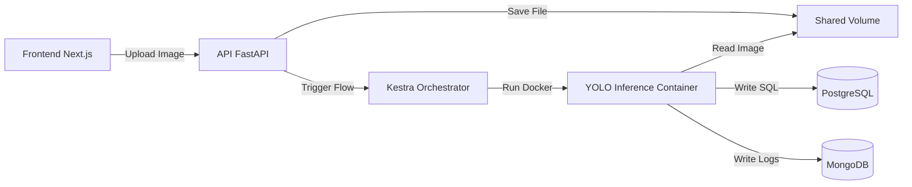

# Wildfire Detection System - Monorepo

Sistema de detecção de incêndios florestais usando Computer Vision (YOLOv8) com orquestração via Kestra e Frontend em Next.js.

## � Status do Projeto

- ✅ **Backend:** API FastAPI Completa (Auth, Upload, Reports)
- ✅ **Pipeline:** Orquestração Kestra + ML Flow (YOLOv8)
- ✅ **Frontend:** Next.js Dashboard (Upload, Lista, Gráficos Chart.js, Bounding Boxes)
- ✅ **Infra:** Docker Compose (Postgres, Mongo, Kestra, API)
- ⏳ **Deploy:** Pendente

---

## 🚀 Guia de Instalação (Setup Manual)

Devido a políticas de segurança da imagem Docker do Kestra, **o registro os fluxos de automação requer uma etapa manual**. Siga a ordem abaixo:

### 1. Iniciar Infraestrutura

```bash
cd back
docker-compose up -d --build
```

Aguarde ~30 segundos para todos os serviços subirem.

### 2. Configuração Manual do Kestra (CRÍTICO 🚨)

O script de automação pode falhar com erro 401. Para corrigir:

1. Acesse o **Kestra UI**: [http://localhost:8080](http://localhost:8080)
2. Faça login com as credenciais padrão:
   - **User:** `admin@kestra.io`
   - **Pass:** `kestra` (ou tente `admin` / `Admin1234`)
3. No menu lateral, clique em **Flows** -> **Create**.
4. Copie o conteúdo do arquivo `back/kestra/flows/fire_inference.yaml`.
5. Cole no editor e clique em **Save**.

*Agora o sistema de inferência está ativo!*

### 3. Iniciar Frontend

```bash
cd front
npm install
npm run dev
```

Acesse o Dashboard: [http://localhost:3000](http://localhost:3000)

---

## 🔗 Links de Acesso

| Serviço | URL | Credenciais (Default) |
| :--- | :--- | :--- |
| **Frontend** | [http://localhost:3000](http://localhost:3000) | Crie sua conta na tela de Login |
| **API Docs** | [http://localhost:8000/docs](http://localhost:8000/docs) | - |
| **Kestra UI** | [http://localhost:8080](http://localhost:8080) | `admin@kestra.io` / `kestra` |

---

## 🏗️ Arquitetura



## 🛠️ Comandos Úteis

**Reiniciar tudo (com perda de dados):**
```bash
cd back
docker-compose down -v
docker-compose up -d
# Lembre-se de recadastrar o Flow no Kestra manualmente!
```

**Ver logs da API:**
```bash
docker-compose logs -f api
```

**Rodar Build do Frontend:**
```bash
cd front
npm run build
```

## � Documentação Técnica

- [Backend README](./back/README.md)
- [Commits Log](./back/commits.md)
- [Barriers & Trade-offs](./back/barriers.md)
