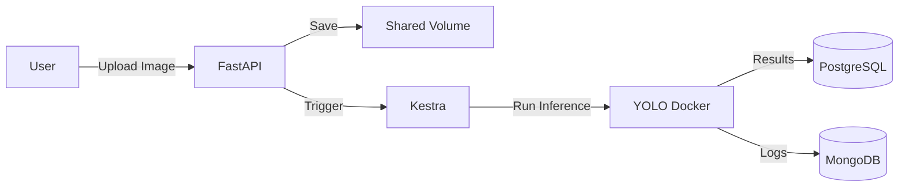

# Wildfire Detection System - Monorepo

Sistema de detecção de incêndios florestais usando Computer Vision (YOLOv8) com orquestração via Kestra.

## 📁 Estrutura do Projeto

```
teste_tecnico/
├── back/              # Backend (FastAPI + Kestra + ML)
│   ├── backend/       # Código FastAPI
│   ├── kestra/        # Workflows de orquestração
│   ├── docker-compose.yml
│   └── README.md      # Documentação do backend
├── front/             # Frontend (Next.js) - Em desenvolvimento
└── antigravity-kit/   # Ferramentas de desenvolvimento
```

## 🚀 Quick Start

### Backend

```bash
cd back
docker-compose up -d
```

Acesse:
- **API:** http://localhost:8000
- **Kestra UI:** http://localhost:8080
- **Docs:** http://localhost:8000/docs

### Frontend

```bash
cd front
npm install
npm run dev
```

Acesse: http://localhost:3000

## 🏗️ Arquitetura



## 🛠️ Stack Tecnológica

### Backend
- **API:** FastAPI (Python 3.10)
- **Orquestração:** Kestra
- **ML:** YOLOv8 (Ultralytics)
- **Databases:** PostgreSQL + MongoDB
- **Autenticação:** JWT

### Frontend
- **Framework:** Next.js 14
- **UI:** React + Tailwind CSS
- **State:** React Query

## 📚 Documentação

- [Backend README](./back/README.md) - Setup e arquitetura do backend
- [Commits Log](./back/commits.md) - Histórico de mudanças
- [Learning Log](./back/learning.md) - Aprendizados do projeto

## 🔧 Desenvolvimento

### Pré-requisitos
- Docker & Docker Compose
- Node.js 18+ (para frontend)
- Python 3.10+ (para desenvolvimento local)

### Comandos Úteis

```bash
# Backend
cd back
docker-compose up -d          # Iniciar serviços
docker-compose logs -f api    # Ver logs da API
docker-compose down           # Parar serviços

# Frontend
cd front
npm run dev                   # Servidor de desenvolvimento
npm run build                 # Build de produção
npm run lint                  # Linter
```

## 📊 Status do Projeto

- ✅ **Backend:** Funcional (API + Kestra + ML Pipeline)
- 🚧 **Frontend:** Em desenvolvimento
- ⏳ **Testes:** Pendente
- ⏳ **Deploy:** Pendente

## 🤝 Contribuindo

Este é um projeto de teste técnico. Para mais informações, consulte a documentação específica de cada módulo.

## 📝 Licença

Projeto educacional - Teste Técnico
